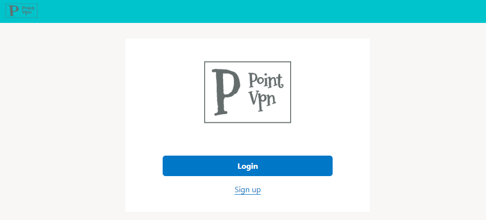
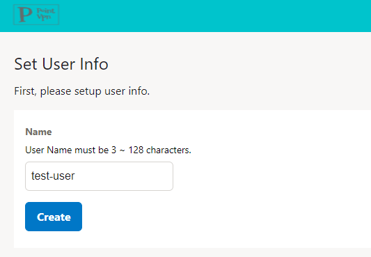
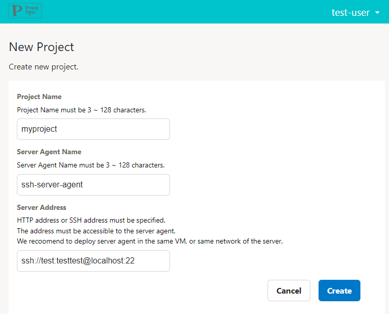
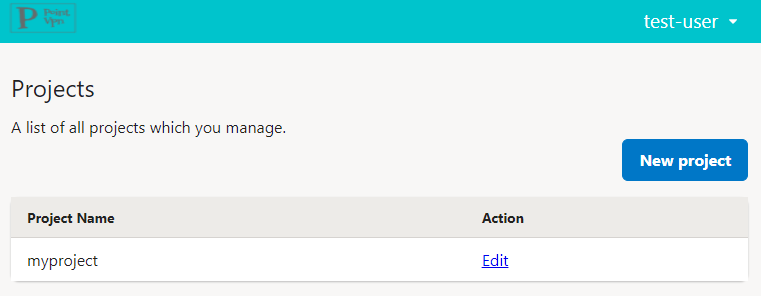
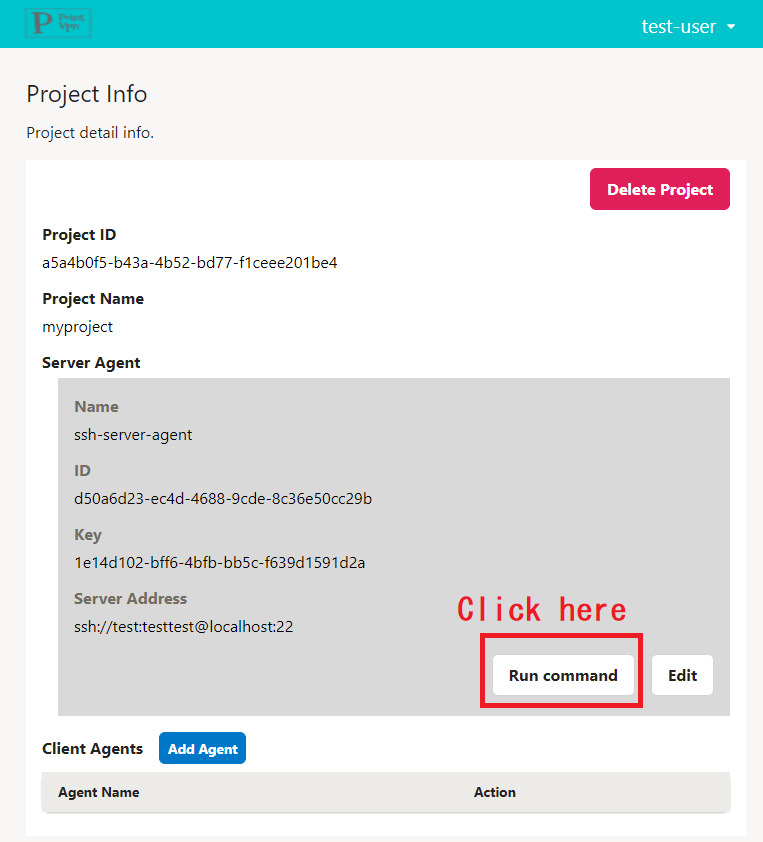
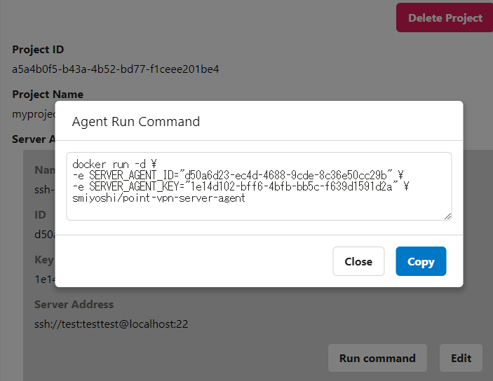
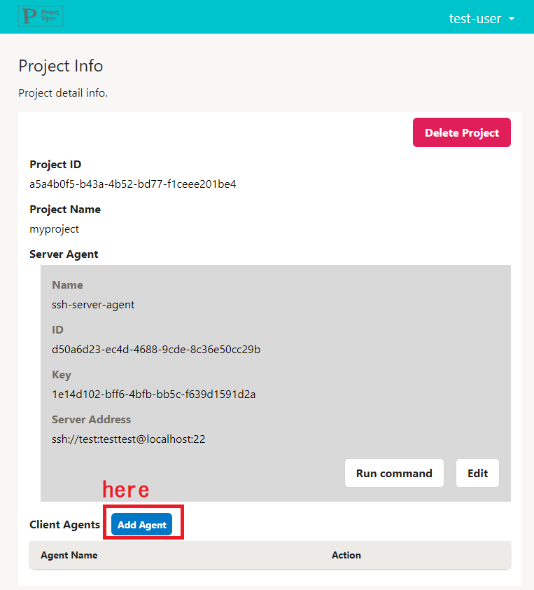
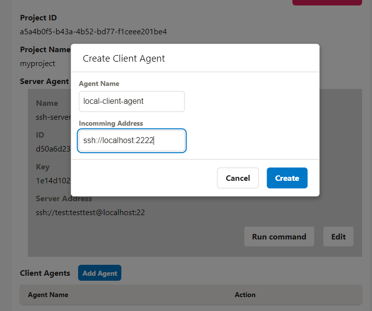
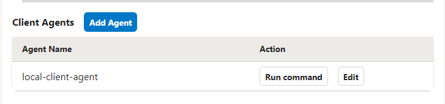

# How to access to SSH server

This page describes how to access the SSH server you manage.

## Before you begin

- SSH server
  - the SSH server that you want to access
- A server to install server agent
  - Anywhere you can access the SSH server (even within the same computer) is ok.
  - Install Docker
  - If you control Outbound communication by Firewall, please allow communication to https://point-vpn-controller.onrender.com and https://router-wq3ixsscka-uc.a.run.app
- Your local PC
  - Install Docker
  - Install SSH Client(ssh command)
  - If you control Outbound communication by Firewall, please allow communication to https://point-vpn-controller.onrender.com and https://router-wq3ixsscka-uc.a.run.app

## Steps

### 1. Login

Access to Point-VPN Console(https://point-vpn-controller.onrender.com) via web browser(chrome, edge, ...)

Select "Sign up" for the first time, or "Login" for the second and subsequent times.



If you are logging in for the first time, please also register your User Name after logging in.



### 2. Create a project

First, create a Project to manage access.
Note that one Server Agent and multiple Client Agents can be registered in a project.
After logging in, select "New project".
After entering the necessary information, click the "Create" button.
Outgoing Address specifies where the SSH server is accessed from the Server Agent.
Format is `ssh://<username>:<password>@<address>:<port>`.
※SSH currently supports password authentication only; public key authentication is in the works



### 3. Start server agent

Next, start the Server Agent.
From the Project List page, click the "Edit" button for the Project you just created.



Go to the Project Details page, where you can manage Server Agents and Client Agents.
The command to start the Server Agent is displayed by pressing the "Run Command" button in the Server Agent block.
Copy the value and execute it on the server where you want to install the Server Agent.





### 4. Register and start client agent

Finally, register and activate the Client Agent.

Click the "Add Agent" button on the Project Details screen of the browser again.



Enter the required information and click the "Create" button.
Specify the address to be accessed by the SSH client in the "Incomming Address" field.
You can enter a user name and password, but they will be ignored for now.



Obtain the startup code from the "Run Command" button as in the case of the Server Agent, and execute it on your PC to start the Client Agent.
After starting the Client Agent, access the address specified in the "Incomming Address" field with the SSH command.



```bash
ssh localhost -p 30000
```

Happy SSH!
