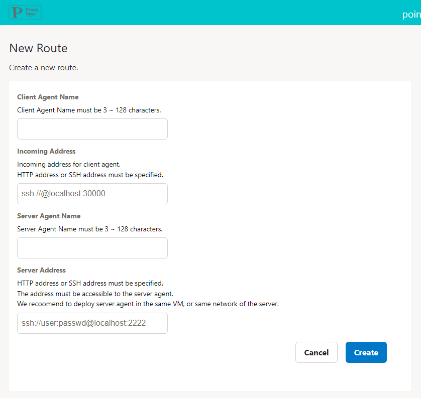
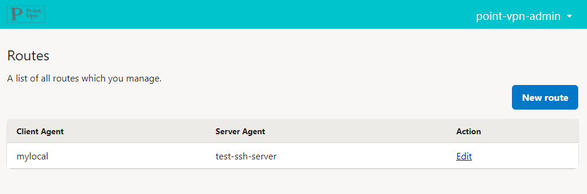
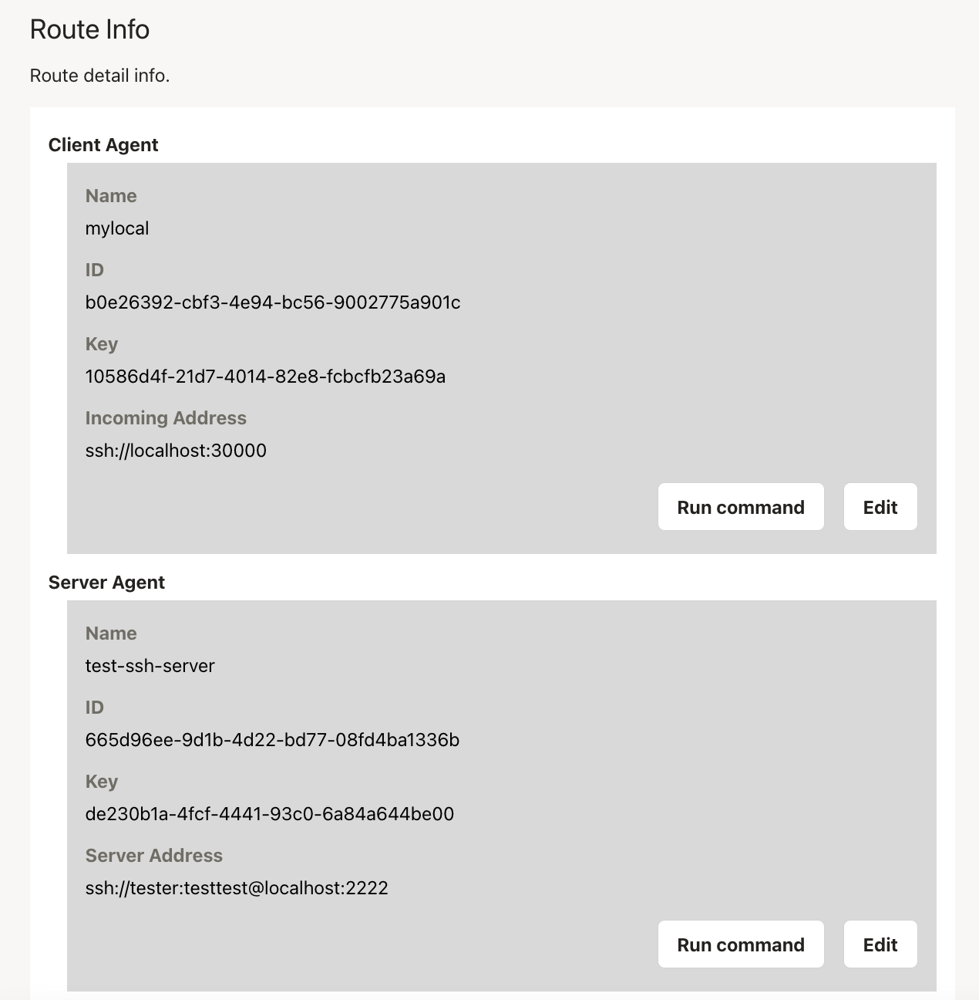
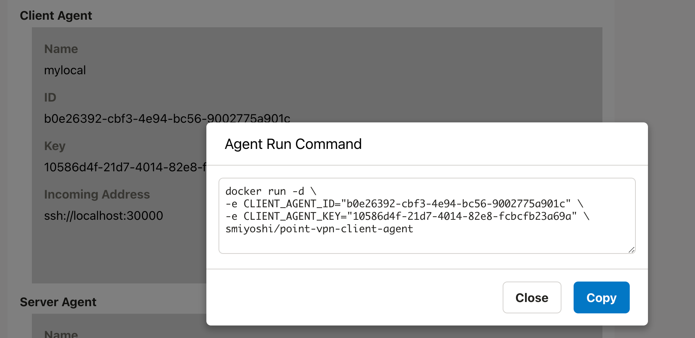

# How to access to SSH server

This page describes how to access the SSH server you manage.

## Before you begin

- SSH server
  - the SSH server that you want to access
- A server to install server agent
  - Anywhere you can access the SSH server (even within the same computer) is ok.
  - Install Docker
  - If you control Outbound communication by Firewall, please allow communication to https://point-vpn-controller.onrender.com and https://router-wq3ixsscka-uc.a.run.app
- Your local PC
  - Install Docker
  - Install SSH Client(ssh command)
  - If you control Outbound communication by Firewall, please allow communication to https://point-vpn-controller.onrender.com and https://router-wq3ixsscka-uc.a.run.app

## Steps

### 1. Login

Access to Point-VPN Console(https://point-vpn-web.onrender.com/login) via web browser(chrome, edge, ...)

Select "Sign up" for the first time, or "Login" for the second and subsequent times.


If you are logging in for the first time, please also register your User Name after logging in.


### 2. Create a route

First, create a Route to manage access.
A Route manages information such as which Server Agents communicate with which Client Agents.

After logging in, select "New route".
After entering the necessary information, click the "Create" button.

Specify the address to be accessed by the SSH client in the "Incoming Address" field in Client Agent block.
You can enter a user name and password, but they will be ignored for now.

Outgoing Address in Server Agent block specifies where the SSH server is accessed from the Server Agent.
Format is `ssh://<username>:<password>@<address>:<port>`.
※SSH currently supports password authentication only; public key authentication is in the works



### 3. Start server agent

Next, start the Server Agent.
From the Route List page, click the "Edit" button for the Route you just created.



Go to the Route Details page, where you can manage Server Agents and Client Agents.



The command to start the Server Agent is displayed by pressing the "Run Command" button in the Server Agent block.
Copy the value and execute it on the server where you want to install the Server Agent.


### 4. Start client agent

Finally, start the Client Agent.

Again, from the Route details screen of the browser, press the "Run Command" button in the Client Agent block.

Copy the displayed value and execute it on your PC to start the Client Agent.
After starting the Client Agent, access the address specified in the "Incoming Address" field with the SSH command.



```bash
ssh localhost -p 30000
```

Happy SSH!
