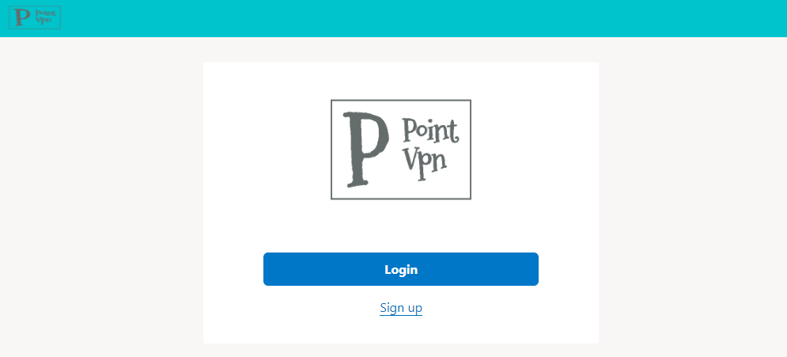
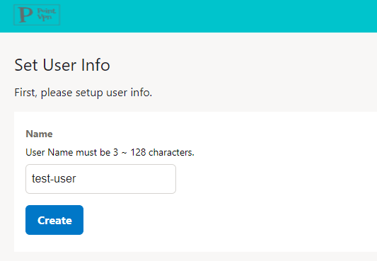

# SSHサーバーにアクセスする方法

ここではあなたが管理するSSHサーバーにアクセスする手順を説明します。

## 事前に準備するもの

- SSHサーバー
  - アクセス先のSSHサーバー
- Server Agentをインストールするサーバー
  - SSHサーバーにアクセスできる場所であればどこでも大丈夫です
    - SSHサーバーと同じサーバーでも問題ありません
  - Dockerをインストールしてください
  - FirewallでOutbound通信を制御している場合は、https://point-vpn-controller.onrender.com と https://router-wq3ixsscka-uc.a.run.app への通信を許可してください
- SSHでアクセスするPC
  - Dockerをインストールしてください
  - SSHクライアント(sshコマンド)をインストールしてください
  - FirewallでOutbound通信を制御している場合は、https://point-vpn-controller.onrender.com と https://router-wq3ixsscka-uc.a.run.app への通信を許可してください

## 手順

### 1. ログイン

ブラウザからPoint-VPN Console(https://point-vpn-controller.onrender.com)にアクセスします

初回の場合は「Sign up」、2回目以降の場合は「Login」を選択してください



初回ログインの場合は、ログイン後、User名の登録もお願いします



### 2. Routeの作成

まずはアクセスを管理するRouteを作成します。
RouteはどのServer AgentとどのClient Agentが通信するかといった情報を管理しています。
ログイン後、「New route」を選択してください
必要な情報を入力後、「Create」ボタンを押してください

Client AgentブロックのIncomming AddressはSSHクライアントでアクセスするためのアドレスを指定してください
ユーザー名、パスワードは入力できますが、現在は無視されます

Server AgentブロックのOutgoing AddressにはServer AgentからSSHサーバーへのアクセス先を指定します
Formatは`ssh://<username>:<password>@<address>:<port>`になります
※SSHは現在パスワード認証のみサポートしており、公開鍵認証は制作中です


### 3. Server Agentの起動

次にServer Agentを起動してみましょう。
Route一覧ページから先ほど作成したProjectの「Edit」ボタンを押してください


移動先はProject詳細ページで、ここでServer AgentやClient Agentの管理ができます
Server Agentの起動コマンドは、Server Agentのブロックの「Run Command」ボタンを押すと表示されます
その値をコピーし、事前に準備したServer Agentをインストールするサーバー上で実行してServer Agentを起動してください


### 4. Client Agentの登録と起動

最後に自身がアクセスするClient Agentを登録し起動させます。

再びブラウザのProject詳細画面から「Add Agent」ボタンを押してください


必要な情報を入力し「Create」ボタンを押してください


Server Agentの場合と同様に「Run Command」ボタンから起動コードを取得し、自身のPCで実行してClient Agentを起動してください
Client Agent起動後、Incomming Addressで指定したアドレスに対してSSHコマンドでアクセスしてください


```bash
ssh localhost -p 30000
```

Happy SSH!
