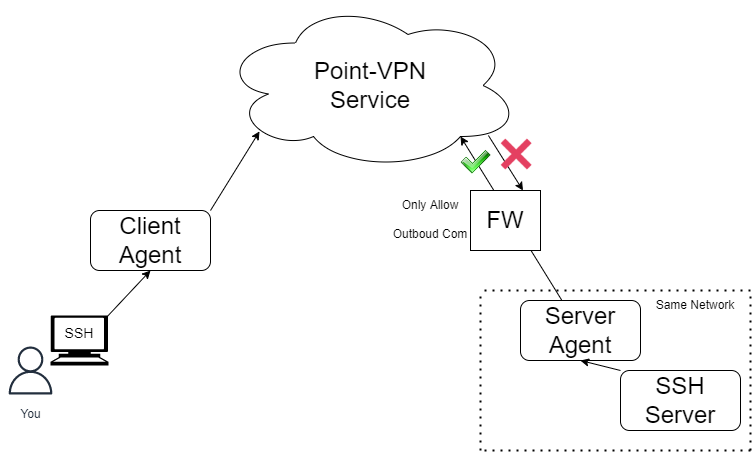

# Point-VPN

日本語版は[こちら](./index_jp.md)。

## What's Point-VPN?

Point VPN is a service that provides a next generation VPN (Virtual Private Network).
Originally, VPN software has been used to connect securely via the Internet.
VPN software connects networks(IP layer) to each other.

However, what you really wanted to do was to securely access applications that exist on your network, right?
For example, you only need to be able to access the SSH server that you manage, and you didn't really want to worry about the status of the network below it, did you?

Point-VPN is a service that allows you to control connections on an app-by-app basis, rather than connecting networks.
In less than 5 minutes, you can build an environment where only you can access your server, protected by a Firewall.

## Caution

Currently, Point-VPN is still in the Proof of Concept (PoC) stage.
Therefore, we would appreciate it if you could wait for a while before putting it into the production environment.
We look forward to your feedback.

Please give us your feedback from the link below.

https://docs.google.com/forms/d/e/1FAIpQLSdJ_sZ56BMt2ELLJro-eh5cOn2ZvQze04a6WKRgA3W7Jiz97Q/viewform?usp=sf_link

## Architecture of Point-VPN

Please see [here](./architecture.md) for more details.

## Examples

- [How to access to SSH server via Point-VPN](./example_ssh.md)
- [How to access to HTTP server via Point-VPN](./example_http.md)
