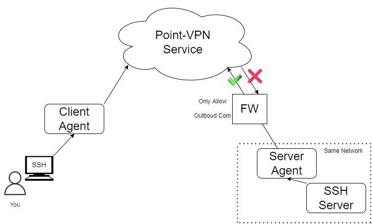

# Point-VPN

## What's Point-VPN?

Point VPNは次世代のVPN(Virtual Private Network)を提供するサービスです。
元来VPNソフトはインターネットを介してセキュアに繋げるために利用されてきました。
VPNソフトはネットワーク同士を繋げます。

しかし、本当にやりたかったことはネットワーク上に存在するアプリにセキュアにアクセスすることではないでしょうか？
例えば、あなたが管理するSSHサーバーにのみアクセスできればよく、その下のネットワークの状況など本来は気にしたくなかったのではないでしょうか？

Point-VPNはネットワークを繋げるのではなく、アプリ単位で接続の制御を行えるようにするサービスです。
5分もあればFirewallに守られたあなたのサーバーに、あなただけがアクセスできる環境を構築できます。

## Caution

現在Point-VPNはまだPoC(Proof of Concept)の段階です。
そのため、本番環境への投入は今しばらくお待ちいただけたらと思います。
また、皆様からの積極的なフィードバックをお待ちしております。

フィードバックは[ここ](https://docs.google.com/forms/d/e/1FAIpQLSeJ_uLqCmH80sbI7V8L5QP_l4kBPEa3ikwE1HHT0T-MCnMazw/viewform?usp=sf_link)からお願いします

## Examples

- [Point-VPNでSSHサーバーにアクセスする方法](./example_ssh_jp.md)
- [Point-VPNでHTTPサーバーにアクセスする方法](./example_http_jp.md)

## Point-VPNのアーキテクチャ

詳細は[こちら](./architecture_jp.md)をご覧ください。
